<!-- ══════════════════════  NAVBAR  ══════════════════════ -->

[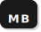](#)&nbsp;&nbsp;&nbsp;&nbsp;&nbsp;&nbsp;&nbsp;&nbsp;&nbsp;&nbsp;&nbsp;&nbsp;&nbsp;&nbsp;&nbsp;&nbsp;&nbsp;&nbsp;&nbsp;&nbsp;&nbsp;&nbsp;&nbsp;&nbsp;&nbsp;&nbsp;&nbsp;&nbsp;&nbsp;&nbsp;&nbsp;&nbsp;&nbsp;&nbsp;&nbsp;&nbsp;&nbsp;&nbsp;&nbsp;&nbsp;&nbsp;&nbsp;&nbsp;&nbsp;

 

<!-- ══════════════════════  HERO  ══════════════════════ -->

<table border="0" cellspacing="0" cellpadding="0" width="100%">
<tr>
<td valign="top" width="500">
 
  
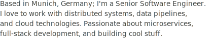  

&nbsp;&nbsp;[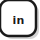](https://linkedin.com)

 

&nbsp;&nbsp;

</td>
<td valign="middle" align="right" width="300">
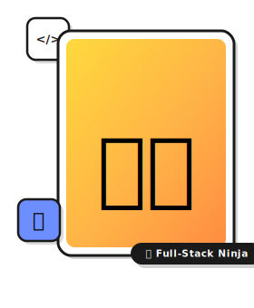
</td>
</tr>
</table>

 

<!-- ══════════════════════  TECH PILLS  ══════════════════════ -->

&nbsp;&nbsp;&nbsp;[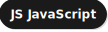](#)&nbsp;&nbsp;&nbsp;&nbsp;

 

<!-- ══════════════════════  DIVIDER  ══════════════════════ -->

 

<!-- ══════════════════════  ABOUT  ══════════════════════ -->

  
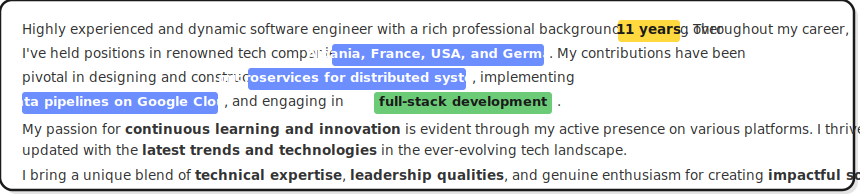

  

<!-- ══════════════════  EDUCATION + LANGUAGES  ══════════════════ -->

<table border="0" cellspacing="0" cellpadding="0">
<tr>
<td valign="top">
  

</td>
<td width="20">&nbsp;</td>
<td valign="top">
  
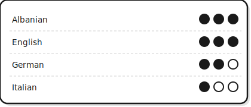
</td>
</tr>
</table>

  

<!-- ══════════════════════  SKILLS  ══════════════════════ -->

  

<table border="0" cellspacing="0" cellpadding="0">
<tr>
<td valign="top">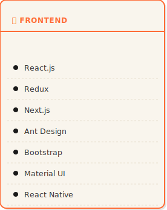</td>
<td width="16">&nbsp;</td>
<td valign="top">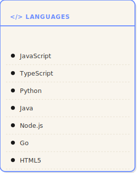</td>
<td width="16">&nbsp;</td>
<td valign="top">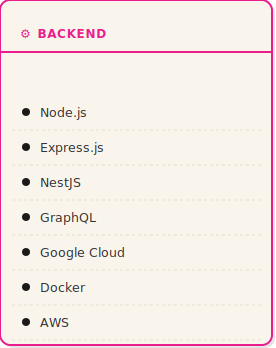</td>
</tr>
</table>

  

<!-- ══════════════════════  MY JOURNEY  ══════════════════════ -->

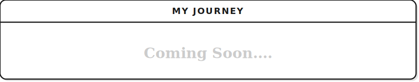

  

<!-- ══════════════════════  EXPERIMENTS  ══════════════════════ -->

 

<table border="0" cellspacing="0" cellpadding="0">
<tr>
<td>[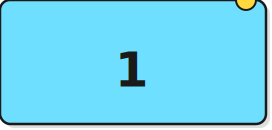](#)</td>
<td width="14">&nbsp;</td>
<td></td>
<td width="14">&nbsp;</td>
<td>[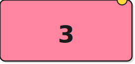](#)</td>
</tr>
<tr><td colspan="5" height="14"></td></tr>
<tr>
<td>[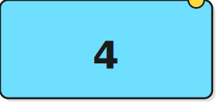](#)</td>
<td width="14">&nbsp;</td>
<td></td>
<td width="14">&nbsp;</td>
<td>[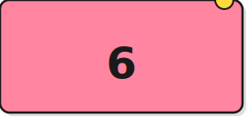](#)</td>
</tr>
<tr><td colspan="5" height="14"></td></tr>
<tr>
<td>[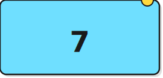](#)</td>
<td width="14">&nbsp;</td>
<td>[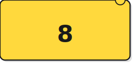](#)</td>
<td width="14">&nbsp;</td>
<td>[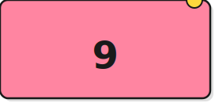](#)</td>
</tr>
</table>

  

<!-- ══════════════════════  FOOTER  ══════════════════════ -->

